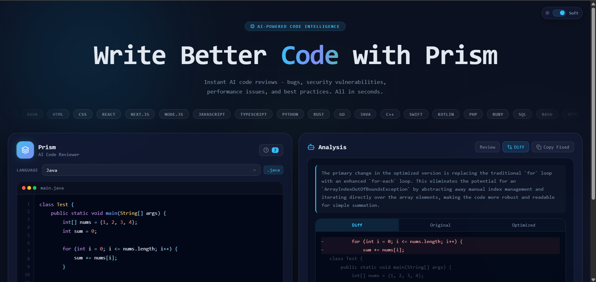
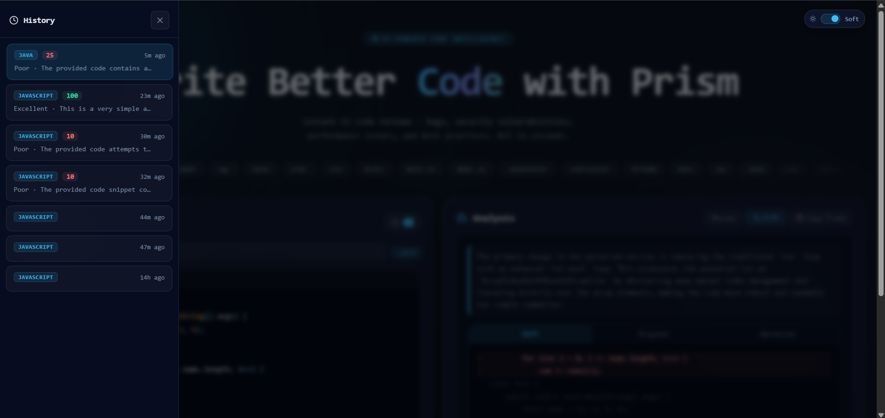

# PRISM CODE REVIEWER  
### AI Powered Code Analysis System

---

<div align="center">


</div>

---

## Overview

Prism Code Reviewer is an AI-powered developer tool that analyzes code and provides structured, intelligent feedback like a senior engineer.

It helps developers:
- Detect bugs instantly  
- Improve code structure  
- Optimize performance  
- Follow best practices  
- Store and track review history  

Built using **React (JSX + CSS), Node.js, Express, and MongoDB**.

---

## Demo

[GitHub Repository](https://github.com/siddhipawar424/prism-code-reviewer)

---

## PREVIEW

<div align="center">

### Main Editor Screen  


<br/>

### History Stored   


</div>

---

## Features

- AI-powered code analysis engine  
- Smart bug detection system  
- Structured feedback (errors, warnings, suggestions)  
- Code optimization recommendations  
- MongoDB history tracking system  
- Real-time API responses  
- Clean developer-focused UI  
- Fully responsive React interface  

---

## Tech Stack

**Frontend**
- React.js (JSX)
- CSS (custom styling)
- Axios

**Backend**
- Node.js
- Express.js
- MongoDB + Mongoose

---

## Architecture

Frontend (React)  
→ API Request (Axios)  
→ Backend (Node + Express)  
→ AI Code Analysis Engine  
→ MongoDB (History Storage)  
→ Response → UI Render  

---

## How It Works

1. User writes/pastes code  
2. Frontend sends request to backend  
3. AI engine analyzes code  
4. Issues + suggestions are generated  
5. Response returned to UI  
6. Stored in MongoDB history  

---

## AI Capabilities

- Static code analysis  
- Logic error detection  
- Performance improvements  
- Clean code recommendations  
- Human-readable explanations  

---

## Database (MongoDB)

Stores:
- Code snippets  
- AI review results  
- Timestamped history  
- User sessions (optional extension)  

---

## Environment Variables

```env
PORT=5000
MONGO_URI=your_mongodb_connection_string
AI_API_KEY=your_api_key_here
